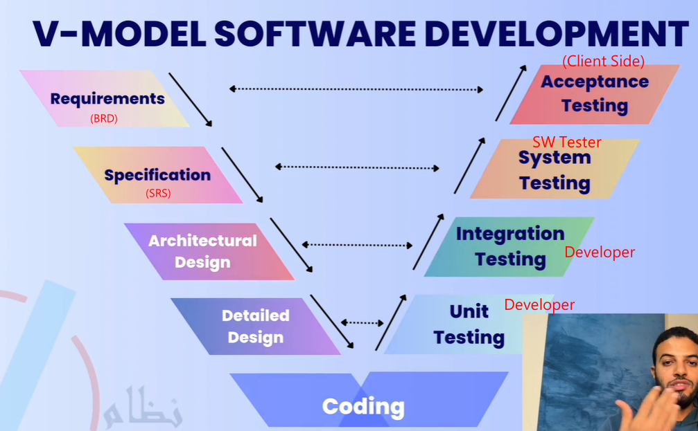
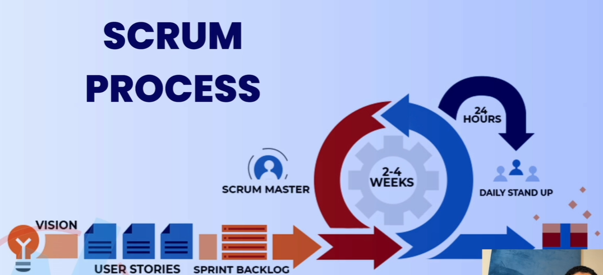
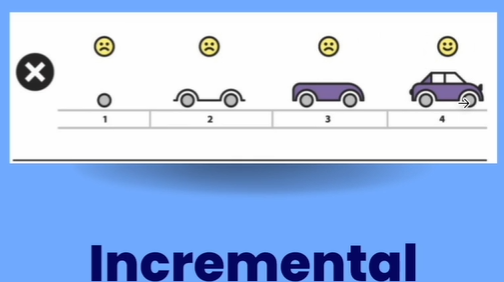
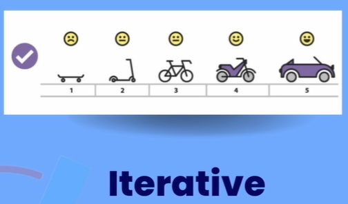
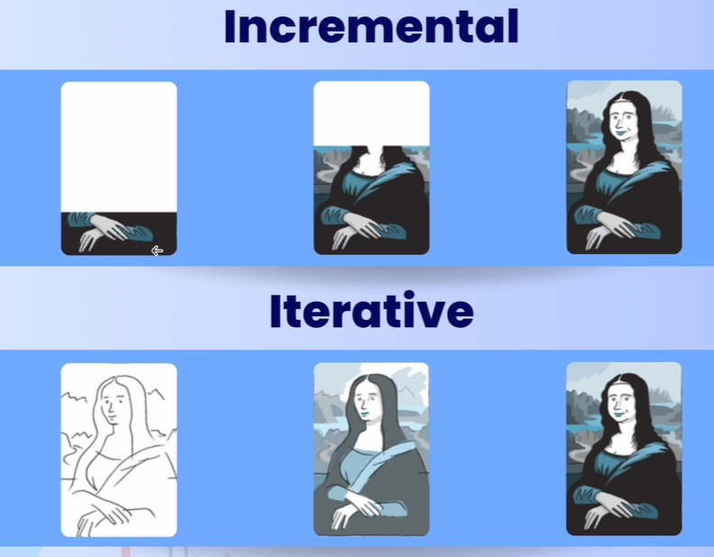

- [[Software Testing]]
	- Software Development
		- V-Model
			- 
		- #Agile
			- 12 principles
			- 4 values
			- Agile & Scrum
				- Agile 是一種精神, 而 Scrum 是一實現 Agile 的一種方法
					- SPRINT = ITERATION
					- 
		- Sequential Evelopment
			-
		- Incremental Development
		  collapsed:: true
			- Build one part and deliver build another part and integrate previous parts
			- 
			-
		- Iterative Development
		  collapsed:: true
			- Build a whole application in every iteration (ex. 2 weeks) and improve the application in every iteration
				- minimum number of features and functions that are usable
			- 
		- 
	- Mix use of Incremental & Iterative Development
		- Every Iteration (delivery) is an whole application within every Iteration, apply the Incremental model
		- Ex.
			- 裝潢3個房間 (將同一種類型的工作, 放在一起做 --> Iteration)
				- 先油漆
				- 安裝燈光
				- 擺放家具
			- 裝潢1000個房間
				- 先將第1個房間進行完整的裝潢, 作為 prototype, the get feedback and approval from the client
				- 再對剩餘的999個房間進行 Iteration 裝潢, 先油漆, 安裝燈光, 再擺放家具
		- 同樣的 Task, 少量及大量會採取不同方法進行開發, 所以最好要混合 Incremental & Iterative 開發方式來做
		-
	- esting Types
	  collapsed:: true
		- Functional Testing
			- Testing what the system does
			- Usually answered with Yes/No
		- Non-functional Testing
			- Testing how the system performs
			- Hard to answer with Yes/No
			- Usually measured as a range
			-