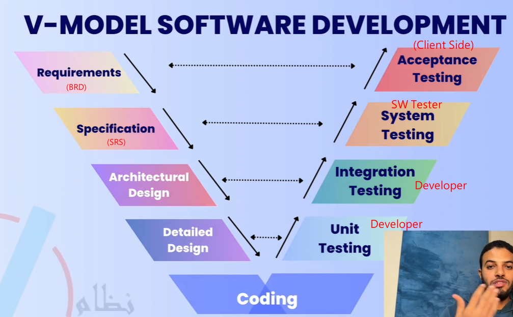
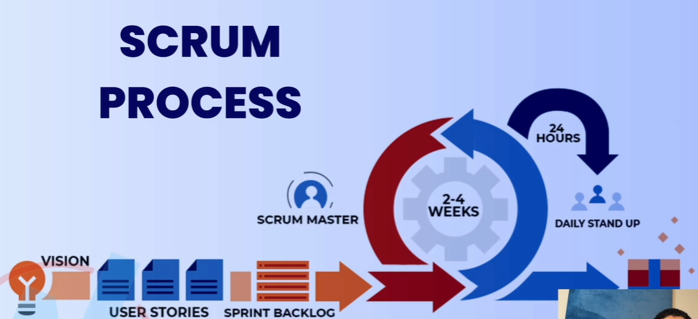
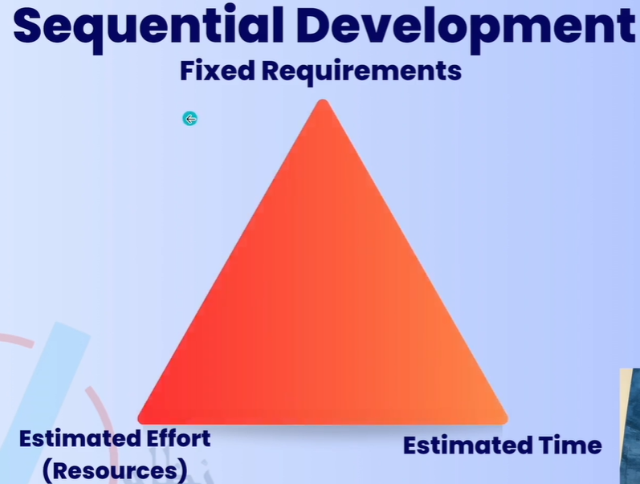
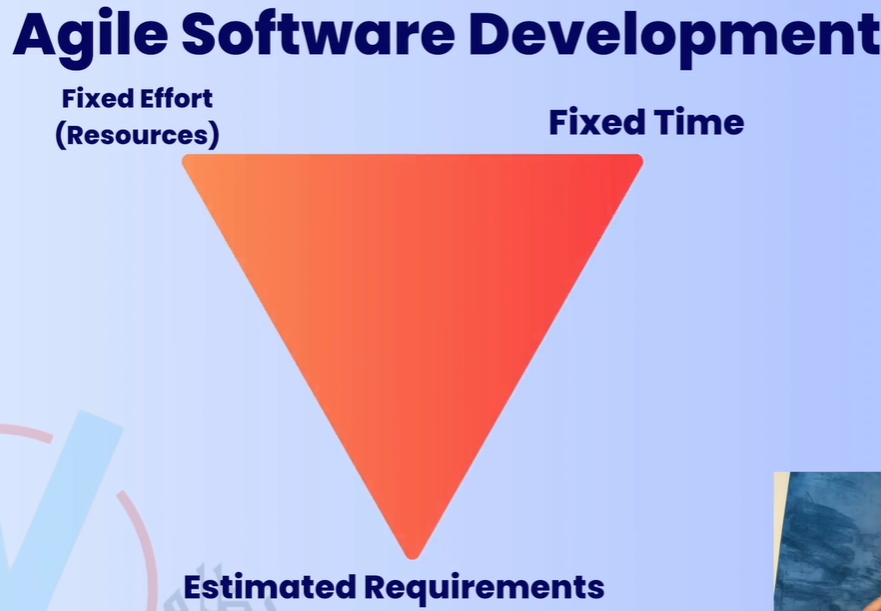
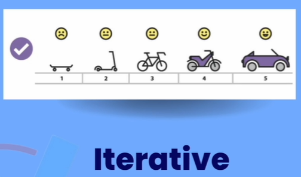

- Software Development
  collapsed:: true
	- V-Model
	  collapsed:: true
		- 
	- #Agile
		- 12 principles
		- 4 values
		- Agile & Scrum
			- Agile 是一種精神, 而 Scrum 是一實現 Agile 的一種方法
			- Scrum
				- Divide a project into small iterations --> SPRINTS
					- Each  SPRINT is  from 1 to 4 weeks
				- SPRINT = ITERATION
				- Vision
					- What we are going to develop
				- Doc: product backlog = SRS & BRD
					- user stories : requirements
					- product owner : user stories 的作者
				- 
	- Sequential Development
		- 
	- Agile Software Development
		- 
	- Incremental Development
	  collapsed:: true
		- Build one part and deliver build another part and integrate previous parts
		- 
		-
	- Iterative Development
	  collapsed:: true
		- Build a whole application in every iteration (ex. 2 weeks) and improve the application in every iteration
			- minimum number of features and functions that are usable
		- 
	- 
	- Mix use of Incremental & Iterative Development
		- Every Iteration (delivery) is an whole application within every Iteration, apply the Incremental model
		- Ex.
			- 裝潢3個房間 (將同一種類型的工作, 放在一起做 --> Iteration)
				- 先油漆
				- 安裝燈光
				- 擺放家具
			- 裝潢1000個房間
				- 先將第1個房間進行完整的裝潢, 作為 prototype, the get feedback and approval from the client
				- 再對剩餘的999個房間進行 Iteration 裝潢, 先油漆, 安裝燈光, 再擺放家具
		- 同樣的 Task, 少量及大量會採取不同方法進行開發, 所以最好要混合 Incremental & Iterative 開發方式來做
		-
- Testing Types
	- Dynamic Testing
		-
	- Static Testing
		- review requirements, design, user manuals
		- coding review --> white box testing
		- Early testing save time and money
	- Functional Testing
		- Testing what the system does
		- Usually answered with Yes/No
	- Non-functional Testing
		- Testing how the system performs
		- Hard to answer with Yes/No
		- Usually measured as a range
		-